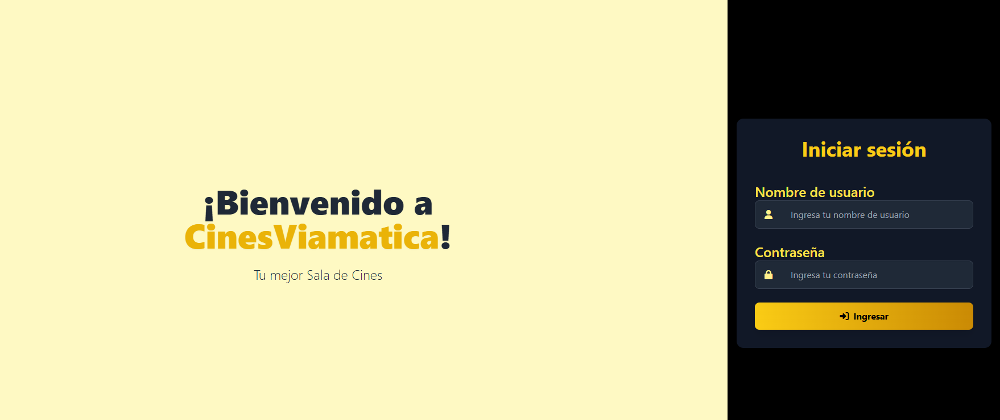
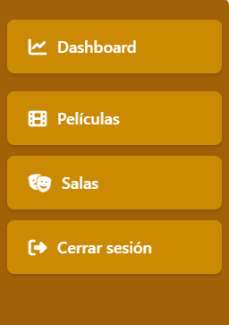
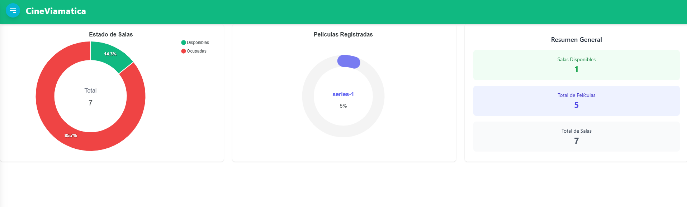
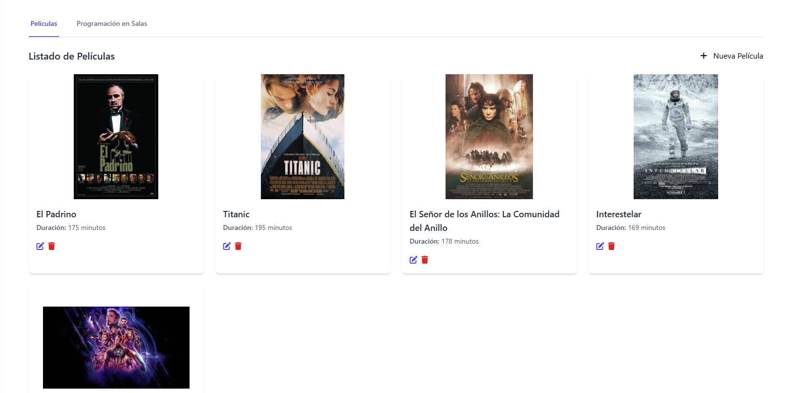
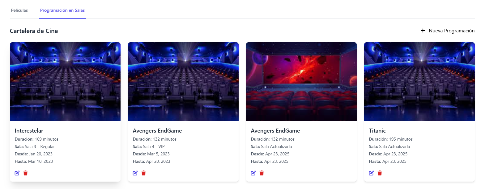
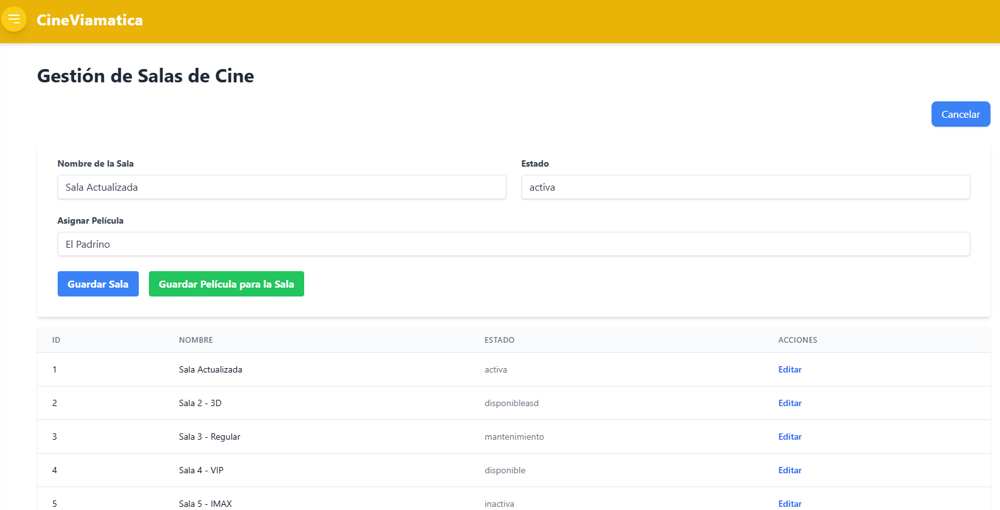

# CineViamatica

This project was generated with [Angular CLI](https://github.com/angular/angular-cli) version 13.3.4.

## Development server

Run `ng serve` for a dev server. Navigate to `http://localhost:4200/`. The application will automatically reload if you change any of the source files.

## Code scaffolding

Run `ng generate component component-name` to generate a new component. You can also use `ng generate directive|pipe|service|class|guard|interface|enum|module`.

## Build

Run `ng build` to build the project. The build artifacts will be stored in the `dist/` directory.

## Running unit tests

Run `ng test` to execute the unit tests via [Karma](https://karma-runner.github.io).

## Running end-to-end tests

Run `ng e2e` to execute the end-to-end tests via a platform of your choice. To use this command, you need to first add a package that implements end-to-end testing capabilities.

## Further help

To get more help on the Angular CLI use `ng help` or go check out the [Angular CLI Overview and Command Reference](https://angular.io/cli) page.

## Descripción del Sistema

Permite visualizar peliculas, crear y actualizar peliculas
Ver las carteleras
Ver un listado de las salas, crearlas, actualizarlas y asignar una pelicula a dicha sala

## Tecnologias usadas
@angular/core	^16.0.0	Núcleo del framework Angular, esencial para el funcionamiento de la aplicación.
@angular/router	^16.0.0	Permite la navegación entre vistas/componentes en Angular.
@angular/material	^16.2.14	Conjunto de componentes UI basados en Material Design.
@angular/forms	^16.0.0	Soporte para formularios reactivos y template-driven.
@angular/fire	^16.0.0	Integración oficial de Angular con Firebase.
rxjs	~7.5.0	Biblioteca reactiva para manejar programación asincrónica.
zone.js	^0.13.3	Utilizado por Angular para detección de cambios automáticos.
animate.css	^4.1.1	Biblioteca de animaciones CSS listas para usar.
@fortawesome/fontawesome-free	^6.6.0	Íconos vectoriales y sociales listos para la web.
ngx-toastr	^18.0.0	Notificaciones tipo "toast" elegantes y configurables.
sweetalert2	^11.14.3	Alertas personalizadas con diseño moderno.
ng-apexcharts	^1.7.0	Gráficas interactivas integradas con Angular.
tailwindcss	^3.4.16	Framework de utilidades para construir interfaces modernas y responsivas.

## Instrucciones
Clonar repositorio y para cada proyecto (Front y Back) usar comando npm i.
Ejecutar Front con ng serve y Back con npm run start.

## Capturas

